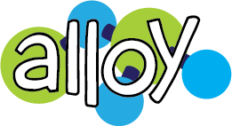
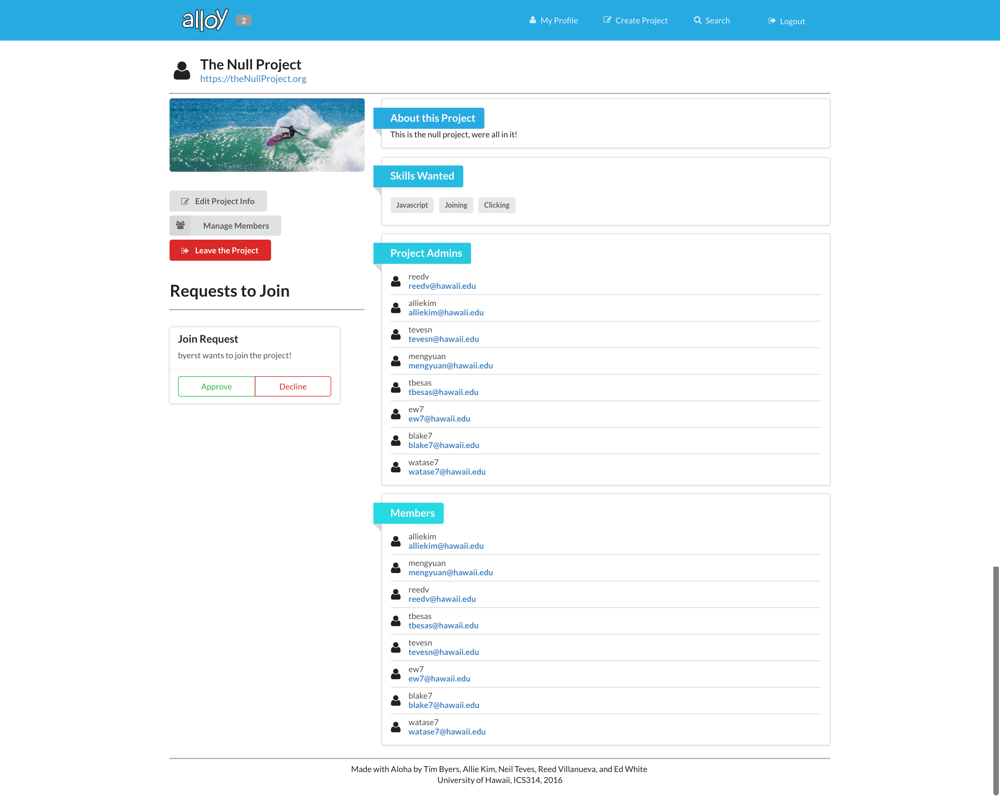
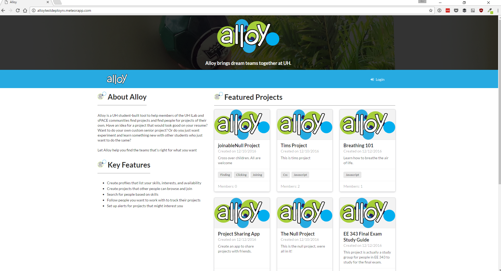

Alloy is a web application designed for a Software Engineering course at the University of Hawaii. It serves as a tool to help members of the University of Hawaii community make their project ideas become a reality. Alloy provides its users with a method of connecting people to projects by allowing people to post their projects which can be seen by the entire Alloy userbase. Within the web application users can also invite people to their projects, and search for interesting projects they would like to become a part of. To put it simply, Alloy bridges the gap between people who have great project ideas and people who want to work on great projects.

There were five contributors working on the development of Alloy in the Fall 2016 semester. My main contributions to the application centered around implementing project creation and incorporating user memberships of the projects. With project creation, I was tasked with developing a page within our app allowing a user to provide information about their project so that it can be posted. This required using a few Semantic UI elements such as forms and dropdowns to provide a user friendly experience to creating their project. I also worked on the membership management aspect of the projects. I elected to provide administrators of projects the ability to manage the members within a project. They are able to remove members, escalate other members to administrative level, allow other users to join the project, and invite users to join the project. With this I needed to incorporate a system of requests/notifications. I implemented a system where users are able to request to join an existing project and the project admins can review these requests and either accept or reject people into their project. I also added the feature of project admins inviting users to join their project. These invitations would go to the user where they can be either accepted or rejected. These were the main components I focused on developing.

Through my work on this project I've been able to improve a wide range of my technical skills. First and foremost I've definitely gained more experience working with Javascript. I've become comfortable developing with it over the course of the project, and I expect to be using it in future projects of mine. I've also gained experience working with Semantic UI elements and HTML in general. I now have a better understanding of how to put pen to paper and create the webpages I visualize in my mind. Much of this has come through the use of the Meteor framework for the development of this web application, and I have also become more comfortable working with Meteor itself. Before this project Meteor was extremely confusing and foreign to me, so I'm happy to say I'm no longer afraid to work with it. Along with this, my ability to use git appropriately for version control and collaboration has improved tremendously. Working in a team of five forced us all to get to know git very well so that we waste less time stepping on each other's toes. Overall this was a great learning experience for both my technical and soft skills, working in a team to develop a web application.

[Check out the project here!](https://alloyteams.github.io/)
