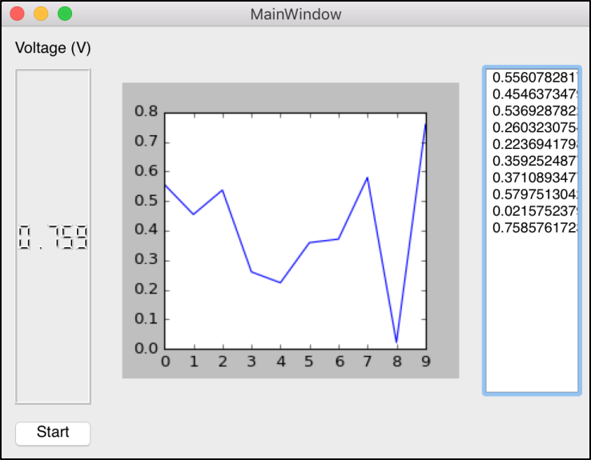
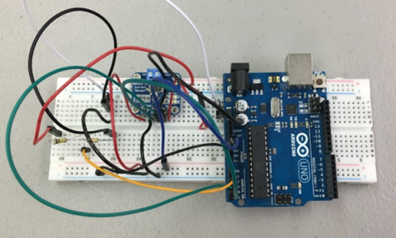
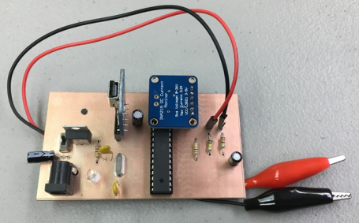

  
  
  
  

The [Smart Campus Energy Lab (SCEL)](http://scel-hawaii.org/) at the University of Hawaii at Manoa focuses on the design and development of low-cost, accurate, and reliable environmental sensor modules that can easily be reproduced for mass deployment on rooftops across the University of Hawaii at Manoa campus. To aid in their development, our team was tasked with developing an in-house data logger to assist SCEL students in conducting their analysis of their components and boards.

I lead the firmware development of the project, where my main focus was handling the communication between the board and the computer. I used serial communications to transmit the data being received on the board to the computer where it could then be processed and handled to be displayed to the user.

This project provided a great opportunity to gain more experience with Python and embedded systems development.

Source Code: [https://github.com/byerst/SCEL-Instrumentation](https://github.com/byerst/SCEL-Instrumentation)
