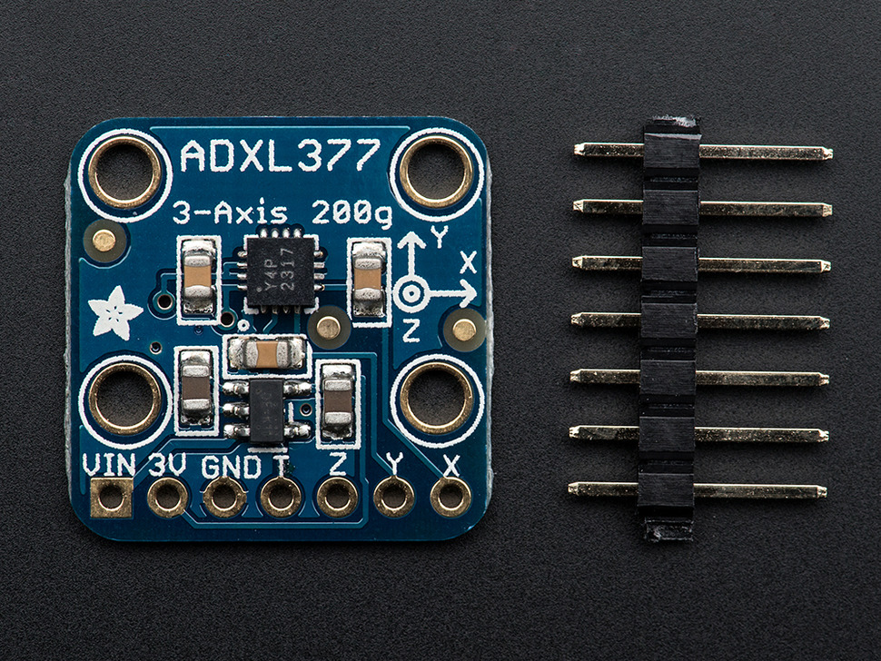

  
  
  

For the first project of my college career, we were tasked with developing anything we could think of utilizing the [Arduino](https://www.arduino.cc/) technology. My partner and I decided to use the ability of the Arduino to modify a boxing glove so it would measure the force of a punch. To do this we enlisted the help of an accelerometer to measure the XYZ accelerations being experienced by the glove. We used this data to calculate an estimate of force that was applied by the punch.

This project was a great opportunity to get basic programming experience, and also get some hands on hardware experience. I learned about various hardware components, how to solder the components to create connections to the board, and finally how to utilize those connections through code.
